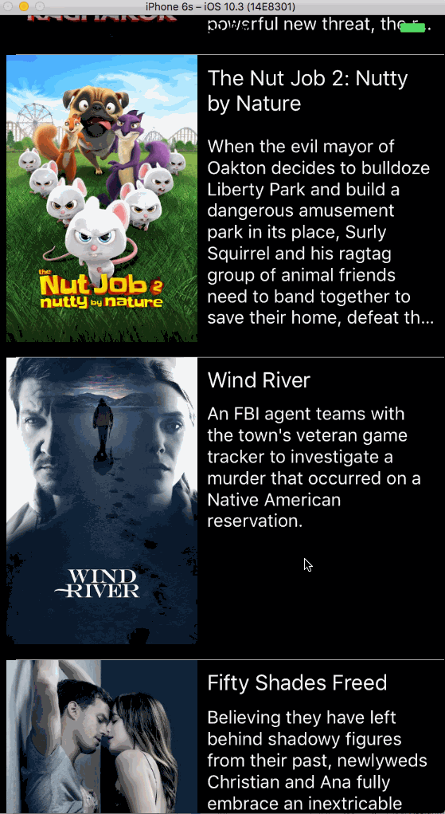

# Assignment 7 Movies

Build a read-only movie listing app using the Movie Database API. This app should talk to the live API to show movies and the ability to see their details. You'll need to make decisions on the following:

How to organize the source code of your app and separate concerns.
What network library to use, if any.
How will you map the JSON from the API to your model.
How will you asynchronously download and display the images.
How will you handle rotating the phone between portrait and landscape.
CocoaPods vs Carthage (iOS only).

Video walk through

GIF created with [LiceCap](http://www.cockos.com/licecap/).

## License

Copyright [2018] [Ling Hao]

Licensed under the Apache License, Version 2.0 (the "License");
you may not use this file except in compliance with the License.
You may obtain a copy of the License at

http://www.apache.org/licenses/LICENSE-2.0

Unless required by applicable law or agreed to in writing, software
distributed under the License is distributed on an "AS IS" BASIS,
WITHOUT WARRANTIES OR CONDITIONS OF ANY KIND, either express or implied.
See the License for the specific language governing permissions and
limitations under the License.
